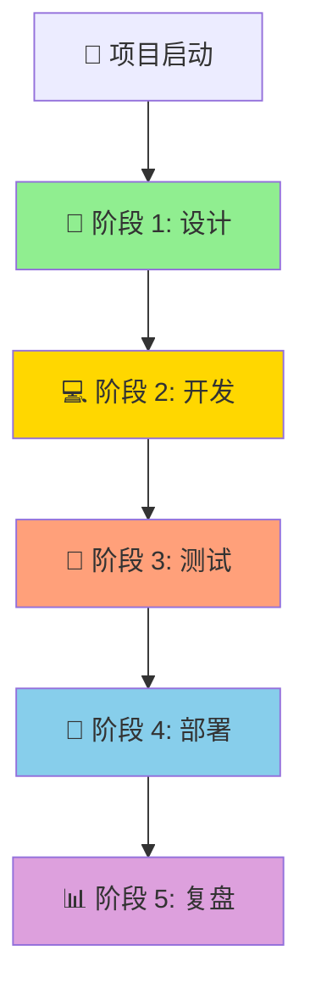
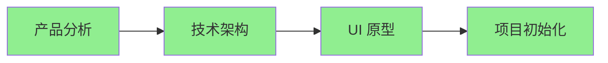
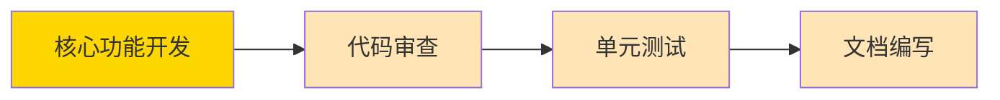
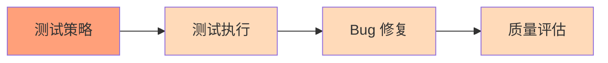
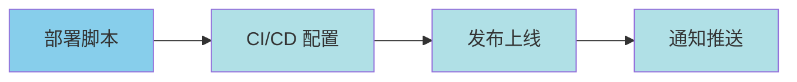
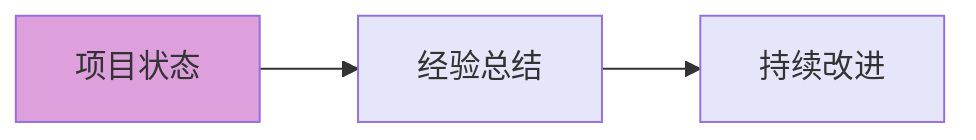

# 🎮《我的中餐厅》v0.1 - 完整工作流程图

**更新日期：** 2026-03-27 11:50  
**项目状态：** 设计阶段完成，准备进入开发阶段

---

## 📊 总体进度（5 阶段）

```
【✅ 完成】    【⏳ 进行中】  【⬜ 待开始】
   1.设计    →   2.开发    →   3.测试    →   4.部署    →   5.复盘
   100%           0%            0%            0%            0%
```

---

## 🔄 完整工作流程图



---

## 📐 阶段 1: 设计（✅ 100% 完成）

### 流程图



### 已完成任务

| 步骤 | 角色 | 输出物 | 状态 | 完成时间 |
|-----|------|--------|------|---------|
| 1.1 产品分析 | gstack:ceo | 产品分析报告 | ✅ | 11:41 |
| 1.2 技术架构 | gstack:eng | 架构文档 + 设计规范 | ✅ | 11:44 |
| 1.3 UI 原型 | gstack:eng | HTML 高保真原型（34.7KB） | ✅ | 11:44 |
| 1.4 项目初始化 | gstack:init | GSTACK.md + 目录结构 | ✅ | 11:44 |

### 交付物清单

**项目 1: WeChat_game01**（现有项目）
- ✅ GSTACK.md
- ✅ 项目目录结构（13 文件）
- ✅ Git 初始化 + 初始提交

**项目 2: my-chinese-restaurant**（新架构）
- ✅ README.md
- ✅ docs/ARCHITECTURE.md（技术架构）
- ✅ docs/DESIGN.md（设计规范）
- ✅ docs/PROJECT_STRUCTURE.md（项目结构）
- ✅ src/prototype.html（可交互原型）

---

## 💻 阶段 2: 开发（⏳ 0% 进行中）

### 流程图



### 待完成任务

| 步骤 | 角色 | 输出物 | 状态 | 预计时间 |
|-----|------|--------|------|---------|
| 2.1 核心功能开发 | gstack:dev | 可运行代码 | ⏳ | 2-3 小时 |
| 2.2 代码审查 | gstack:review | CR 报告 | ⏳ | 15 分钟 |
| 2.3 单元测试 | gstack:test | 测试用例 | ⏳ | 30 分钟 |
| 2.4 文档编写 | gstack:docs | README + API 文档 | ⏳ | 20 分钟 |

### 开发任务分解

#### 任务 2.1: 核心功能开发

**子任务：**
- [ ] 微信小游戏适配（main.js + game.js）
- [ ] 场景管理系统（scene/）
- [ ] 数据模型实现（model/）
- [ ] 渲染系统（view/renderer.js）
- [ ] 存档系统（storage.js）

**预计时间：** 2-3 小时

**输出：**
- `src/main.js` - 入口文件
- `src/game.js` - 游戏主循环
- `src/scene/` - 4 个场景模块
- `src/model/` - 数据模型
- `src/storage.js` - 存档管理

---

## 🧪 阶段 3: 测试（⬜ 0% 待开始）

### 流程图



### 待完成任务

| 步骤 | 角色 | 输出物 | 状态 | 预计时间 |
|-----|------|--------|------|---------|
| 3.1 测试策略 | gstack:qa | 测试计划 | ⬜ | 15 分钟 |
| 3.2 测试执行 | gstack:test | 测试报告 | ⬜ | 30 分钟 |
| 3.3 Bug 修复 | gstack:dev | 修复代码 | ⬜ | 按 Bug |
| 3.4 质量评估 | gstack:qa | 发布建议 | ⬜ | 10 分钟 |

### 测试清单（32 项）

**P0 - 核心功能（18 项）**
- [ ] A01-A03: 启动与加载
- [ ] B01-B10: 核心玩法
- [ ] F01-F05: 平台导入验证

**P1 - 重要功能（10 项）**
- [ ] C01-C05: 经营系统
- [ ] D01-D05: 数据与异常

**P2 - 体验优化（4 项）**
- [ ] E01-E04: UI 与交互

---

## 🚀 阶段 4: 部署（⬜ 0% 待开始）

### 流程图



### 待完成任务

| 步骤 | 角色 | 输出物 | 状态 | 预计时间 |
|-----|------|--------|------|---------|
| 4.1 部署脚本 | gstack:deploy | Dockerfile + 脚本 | ⬜ | 20 分钟 |
| 4.2 CI/CD 配置 | gstack:deploy | GitHub Actions | ⬜ | 15 分钟 |
| 4.3 发布上线 | gstack:ship | 发布说明 | ⬜ | 10 分钟 |
| 4.4 通知推送 | gstack:notify | 飞书/Discord 消息 | ⬜ | 自动 |

---

## 📊 阶段 5: 复盘（⬜ 0% 待开始）

### 流程图



### 待完成任务

| 步骤 | 角色 | 输出物 | 状态 | 预计时间 |
|-----|------|--------|------|---------|
| 5.1 项目状态 | gstack:status | 进度报告 | ⬜ | 5 分钟 |
| 5.2 经验总结 | gstack:retro | 复盘文档 | ⬜ | 15 分钟 |
| 5.3 持续改进 | gstack:retro | 改进清单 | ⬜ | 10 分钟 |

---

## 📍 当前进度详情

### 总体状态

```
阶段 1: 设计 ████████████████████ 100% ✅
阶段 2: 开发 ░░░░░░░░░░░░░░░░░░░░   0% ⏳
阶段 3: 测试 ░░░░░░░░░░░░░░░░░░░░   0% ⬜
阶段 4: 部署 ░░░░░░░░░░░░░░░░░░░░   0% ⬜
阶段 5: 复盘 ░░░░░░░░░░░░░░░░░░░░   0% ⬜
```

### 下一步行动

**立即执行：**
1. @gstack:dev - 开发核心功能（2-3 小时）
   - 微信小游戏适配
   - 场景管理系统
   - 数据模型实现
   - 存档系统

2. @gstack:review - 准备代码审查（15 分钟）
   - 审查清单准备
   - 代码质量标准

3. @gstack:test - 准备测试用例（30 分钟）
   - 单元测试
   - 集成测试

### 时间线

```
11:41 ✅ 产品分析完成
11:44 ✅ 技术架构完成
11:44 ✅ UI 原型完成
11:44 ✅ 项目初始化完成
  ↓
现在 ⏳ 准备开始开发
  ↓
预计 14:00 核心功能开发完成
预计 14:30 代码审查完成
预计 15:00 测试执行完成
预计 15:30 发布上线
```

---

## 🎯 16 个角色参与情况

### 已参与（4 个）

| 角色 | 参与阶段 | 输出物 | 状态 |
|-----|---------|--------|------|
| gstack:ceo | 设计 | 产品分析报告 | ✅ |
| gstack:eng | 设计 | 架构 + 原型 | ✅ |
| gstack:init | 设计 | 项目初始化 | ✅ |
| gstack:status | 全程 | 进度报告 | ✅ |

### 待参与（9 个）

| 角色 | 参与阶段 | 任务 |
|-----|---------|------|
| gstack:dev | 开发 | 核心功能开发 |
| gstack:review | 审查 | 代码审查 |
| gstack:test | 测试 | 测试执行 |
| gstack:qa | 测试 | 测试策略 + 质量评估 |
| gstack:docs | 文档 | README + API 文档 |
| gstack:deploy | 部署 | 部署脚本 + CI/CD |
| gstack:ship | 发布 | 发布上线 |
| gstack:notify | 通知 | 消息推送 |
| gstack:retro | 复盘 | 经验总结 |

### 跳过（3 个）

| 角色 | 原因 |
|-----|------|
| gstack:office | 方向已明确，无需创业导师 |
| gstack:github | v0.1 内测版，无需 PR 管理 |
| gstack:browse | 无需网页交互/数据采集 |

---

## 📋 检查清单

### 阶段 1 完成检查 ✅

- [x] 产品分析报告
- [x] 技术架构文档
- [x] UI 原型（可交互）
- [x] 项目目录结构
- [x] Git 初始化

### 阶段 2 开发检查 ⏳

- [ ] 核心功能代码
- [ ] 代码审查通过
- [ ] 单元测试通过
- [ ] 文档完整

### 阶段 3 测试检查 ⬜

- [ ] 32 项测试执行
- [ ] Bug 修复完成
- [ ] 质量评估通过

### 阶段 4 部署检查 ⬜

- [ ] 部署脚本
- [ ] CI/CD 配置
- [ ] 发布说明

---

## 🎮 项目文件位置

### WeChat_game01（现有项目）
```
~/.openclaw/workspace/WeChat_game01/
├── GSTACK.md
├── README.md
├── .gitignore
├── minigame/
│   └── pages/index/
└── docs/
```

### my-chinese-restaurant（新架构）
```
~/.openclaw/workspace/my-chinese-restaurant/
├── README.md
├── docs/
│   ├── ARCHITECTURE.md
│   ├── DESIGN.md
│   └── PROJECT_STRUCTURE.md
└── src/
    └── prototype.html (可交互原型)
```

---

*简单设计，快速迭代，数据驱动。*
*最后更新：2026-03-27 11:50*
